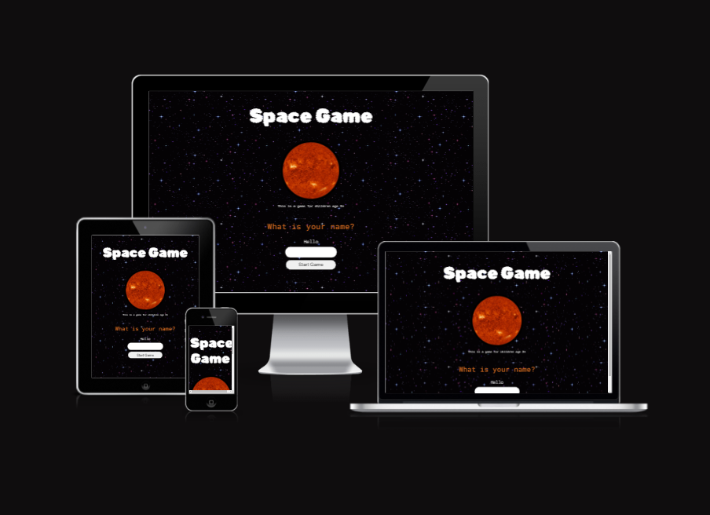

 

# Space Game Project

The purpose of this website was to use Javascript to create an interactive experience for preschool aged children to learn to use a computer/ the Internet and to learn about the universe.

# Initial Design 

This site has been designed to be used by a children from the age of 3 under the supervision of an adult. 

I used Figma to draft two pages, keeping the user’s journey short and focused – the idea behind building a site like this was to help my child learn about our solar system, the milky way and to improve their computer literacy. Since starting the bootcamp I have been spending less time with them and more time on the computer, so I thought it would be nice to do an activity together!  Informal education seems to be important in our house and we have become even more competitive so I knew a quiz would be perfect.

Image 1.

Image 2.

# Final Design

## Landing page 
To keep it simple I wanted the user to start with a landing page which introduced and  required an input which would be stored and presented on the quiz page. The design and layout has been chosen to appeal to a child user, although I made the choice to keep a sense of authenticity and use actual images of the planets instead of cute drawings. I wanted to give ‘Space’ a mysterious quality to maintain the feeling of intrigue in the unknown, which is hopefully echoed again through the background music.

Image 3.

## Quiz page
For consistency the design is similar design to the landing page. Questions a large and distinct from the dark background. The font is clear and can be read from afar by a child or an adult.
As children are usually attracted to pictures, the interactive button element has been replaced by an image which is clickable. Some children can phonetically sound out words and I chose to include the name of the planets once the cursor hovers over the icon to help the children answer some of the questions. As with landing page sound has been included to affect the users experience of the design and function. In the JavaScript, I co-created a function with Komal Karir, to allow alternating sounds to play and alert the user if their answer was right or wrong. I hope children like this and find it amusing!
Once all attempts are complete the game prompts the user with their stored input from the landing page followed by a ‘Game over, try again’ or ‘Well done, “name”!!’. I wanted some keyboard use to assist with their overall computer literacy and to surprize them with personal message!

Question format 1

Positive Personal message

Negative Personal message

Question format 2

Question format 3

# Feedback
My child tested the website and asked me to change the audio and we recorded their own unique sound effects for the right and wrong answer. During the design they also wanted more questions which we included.

# Improvements

The audio on the landing page could be changed to a more childish game themed soundtrack.
The design of the score function on the quiz page could become bolder and more noticeable.
I would like to include more personalised user inputted elements such a pre-setting the colours and pre-recording audio elements to make it more appealing and unique for the user and to develop their overall computer literacy.

Check the website performace - with large media files I would change the file format to decrease the size and pre-connect certain sorces to speed up delivery.

# Credits

TBC
